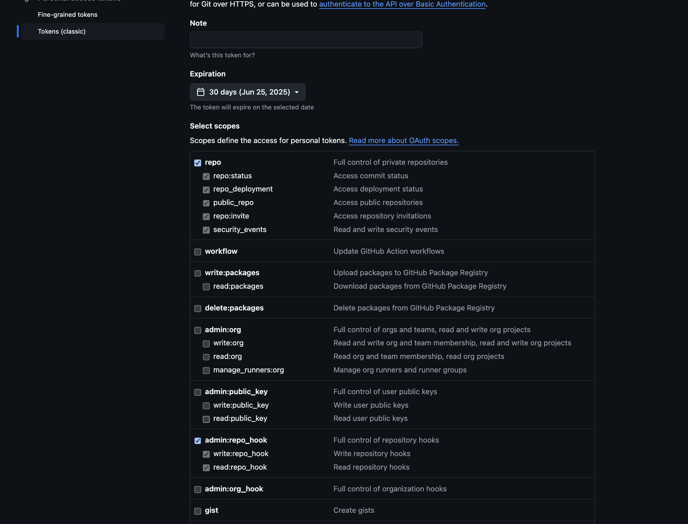
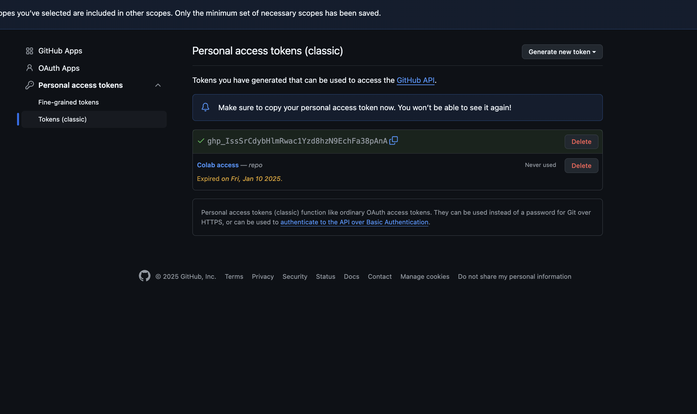
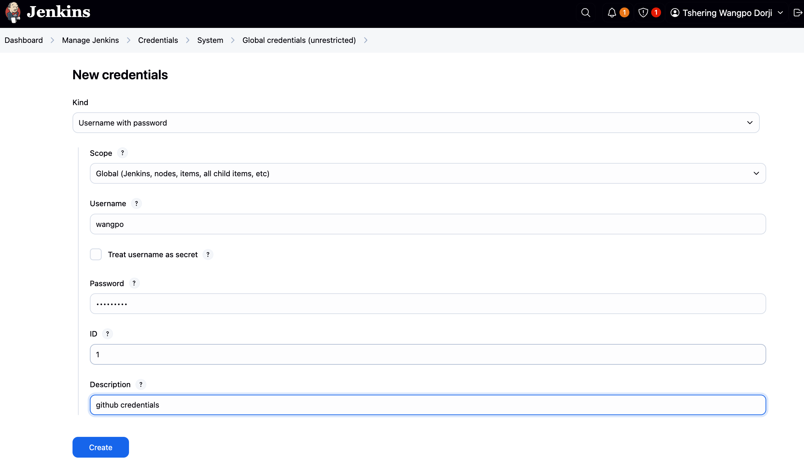
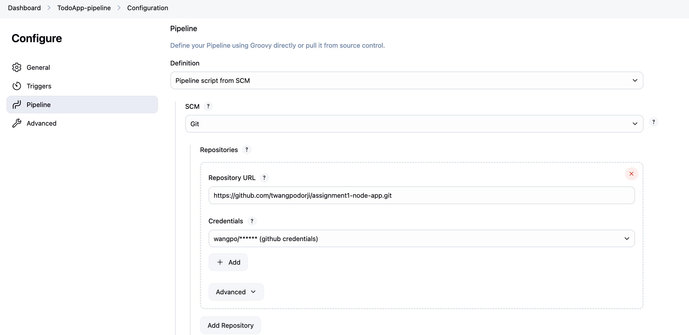
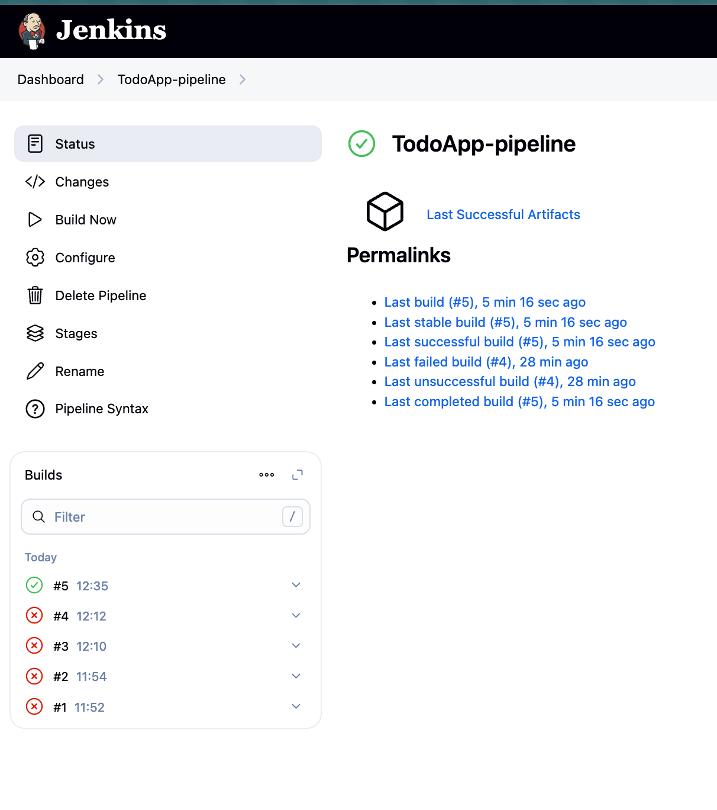
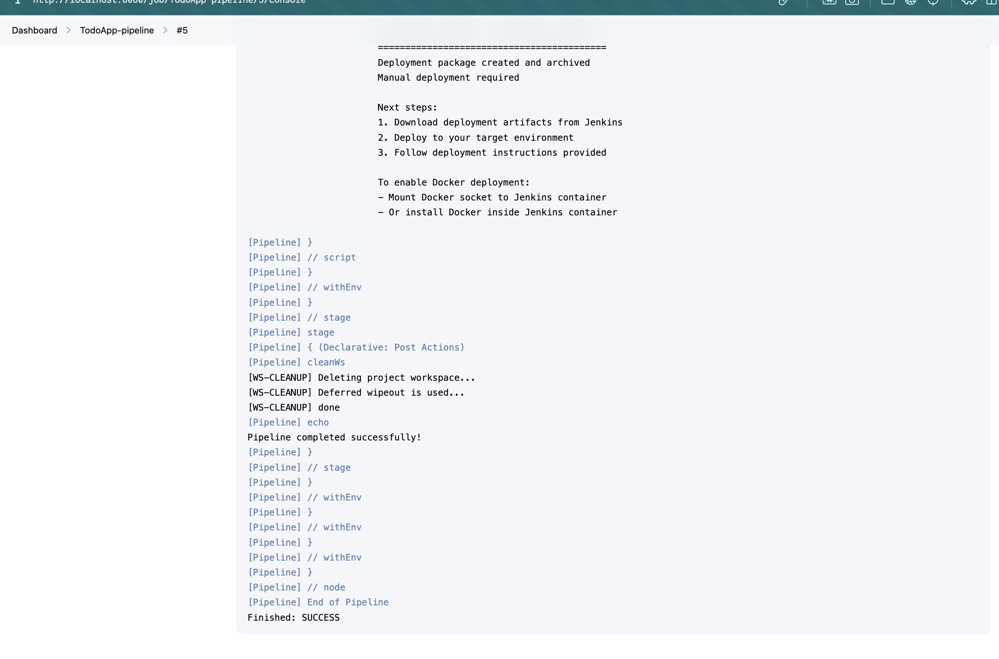

# Assignment II (Continuous Integration and Continuous Deployment)
## CI/CD Pipeline for Todo List Application 

This project demonstrates the implementation of a CI/CD pipeline for a Todo List application using jenjkins CI/CD pipeline for building, testing and deploying the application which is build in [ASSIGNMENT 1](https://github.com/twangpodorji/TsheringWangpoDorji_02230311_DSO101_A1.git)

### Objective
In this assignment, it is going to configure a Jenkins pipeline to automate the build, test, and
deployment of your to-do list application (from Assignment 1). The pipeline will include:
- Code checkout from GitHub
- Dependency installation (npm/yarn)
- Build step
- Unit testing (Jest/Mocha)
- Deployment (Docker or direct server deployment)

### How the Pipeline was configured
**Task 1: Jenkins Setup for Node.js**

Installed Jenkins from jenkins.io/download and ran it on localhost:8080 or containerized it using Docker and spin up a Jenkins container.
```bash
docker run -d -p 8080:8080 -p 50000:50000 jenkins/jenkins:lts
```
Installed the necessary plugins:
- NodeJS Plugin(npm).
- Pipline.
- Github Integration.
- Docker Pipeline (If using Docker).

**Task 2: Node.js Configuration in Jenkins**

- Navigated to Manage Jenkins > Tools > NodeJS.
- Added NodeJS installation (version 24.0.2).
- Enabled automatic installation to ensure npm was properly detected.


**Task 3: GitHub Repository Integration**

Make sure your Node.js application is hosted on GitHub. For example:  
[https://github.com/yourusername/assignment1-node-app](https://github.com/yourusername/assignment1-node-app)

#### Generate a GitHub Personal Access Token (PAT)

1. Navigate to **GitHub > Settings > Developer Settings > Personal Access Tokens**.
2. Create a new token with the following permissions:
   - `repo`
   - `admin:repo_hook`

After following the above steps, it leads to creation a GitHub Personal Access Token (PAT) with repo and admin:repo_hook permissions as shown below





#### Add GitHub Credentials in Jenkins

1. Go to **Manage Jenkins > Credentials > Add Credentials**.
2. Select the **"Username & Password"** option.
3. Fill in the following details:
   - **Username**: Your GitHub username.
   - **Password**: Your GitHub Personal Access Token (PAT).




Connected the pipeline to the repository

**Task 4:Jenkinsfile Implementation** 

In the repository root, Created a Jenkinsfile as shown below: 


**Task 5:Pipeline Execution for Jenkins**

- Created a new pipeline job in Jenkins.
- Configured the pipeline to use SCM (Source Code Management) with Git.
- Provided the GitHub repository URL and selected the credentials created earlier.
- Set the branch to `main` (or the branch you want to build) & the script path to `Jenkinsfile`.



**Task 6: Build and monitor the pipeline for successful execution**




**Successful pipeline execution after N attempts**




### Challenges Faced and Solutions

- **Docker Connetion Failed:** When the Jenkins is runed in a container, it may not have access to the Docker daemon on the host machine.

To resolve this issue, we need to run the Jenkins container with the Docker socket mounted. This allows Jenkins to communicate with the Docker daemon on the host machine but it does not work properly in my case so I have to run the Jenkins in my local machine. 


To reslove this issue it can also be done by the running the Jenkins using Homebrew on MacOS.

Due to the Failure of Connection to Docker Demon, it does not get update to the Docker Hub but overall the pipeline is successfully executed and the application is deployed in the local machine.


# Assignment III : Continuous Integration & Continuous Deployment with GitHub Actions.

This project sets up an automated system that handles a Todo List app built with React (frontend) and Node.js (backend). Whenever code changes are made and being pushed, GitHub Actions automatically builds the app, runs tests, packages everything into Docker containers, and deploys it to the cloud using Render.com. This removes the need for manual deployment and ensures the app is always up-to-date.

#### Github Actions implementation.

1. Checked the Project Structure
     - Made sure both the frontend and backend folders had their package.json files with the right build commands.
     - Verified that each folder had a Dockerfile to create containers.
     - Set the GitHub repository to public so the automation could work properly.

2. Set Up Automated Building and Deployment
     - Created a workflow file that automatically handles building, testing, and deploying the app whenever changes are made to the code.
     
#### Setting Up GitHub Actions Workflow

Complete workflow file is created in the `.github/workflows` directory of the repository. The file is named `ci-cd.yml` and contains the code snippet like shown below:


#### Setting Up Private Information (GitHub Secrets Configuration)

1. Added Security Keys
     - DOCKERHUB_USERNAME: Your DockerHub account name
     - DOCKERHUB_TOKEN: A special password created from your DockerHub account settings for secure access

These secrets let GitHub Actions safely connect to your DockerHub account without exposing your login details in the code.


RENDER_BACKEND_WEBHOOK_URL: Webhook URL for frontend service deployment


RENDER_FRONTEND_WEBHOOK_URL: Webhook URL for backend service deployment


#### Setting Up Cloud Hosting

The frontend and backend apps were already deployed to Render.com from the first assignment

**1. Testing the Automated System**

**First Test Run**

Saved all the automation files to the repository
Uploaded the changes to the main branch
Watched the GitHub Actions section to see the automation working
Confirmed that each step completed without errors


**2. Deployment Verification**

Verified that the Docker containers were successfully created and uploaded to your DockerHub account.


