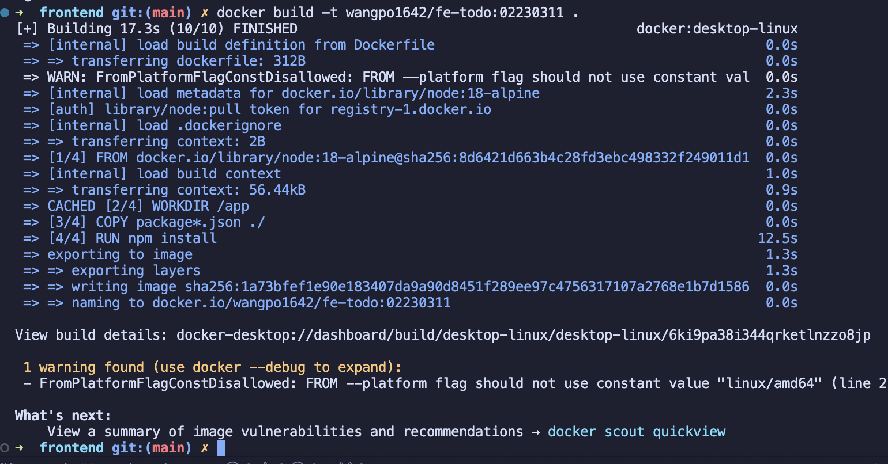

# Todo List Application ( CI/CD Integration )
## Creating the Todo List Application

### Server-Side Architecture and Data Layer (Node.js + PostgreSQL)

- Developed an Express.js web server featuring RESTful API endpoints for comprehensive task  management (CURD) operations.
- Established PostgreSQL database connectivity through configurable environmental variables.
- Integrated Sequelize Object-Relational Mapping(ORM) for streamlined database interactions. 
- Designed a Task data model incorporating description fields and completion tracking.

Core implementation details(Key configurations):

- Dynamic configuration through environment variable management.
- RESTful service endpoints supporting task creation, modification, removal operations as well as for updating task modification status.
- Server deployment configured with flexible port assignment via environment settings. 

A sample UI for the Todo List application which wroks locally with "CRUD" operations is shown below:


### Frontend or Client-Side Interface (React)

- Built a React-based user interface with implementation of components for task management.
- Developed API integration layer for backend communication (i.e sequelize ORM).
- Constructed interactive elements for task visualization, creation, modification, and deletion. 
- Configured dynamic backend connectivity through environment-based API routing

Essential implementation features:

- Environment-driven API endpoint for configuration.
- Dedicated component architecture for task item presentation. 
- Interactive form interface for new task creation.
- Comprehensive editing and removal capabilities.

## Part A: Deploying Pre-built Docker Images and pushing it to the docker hub registry.
1. Building Docker Images for Frontend and Backend and then Pushing to Docker Hub:

    Created Dockerfiles for both frontend and backend applications;
- Backend Dockerfile

```dockerfile 
FROM --platform=linux/amd64 node:18-alpine
RUN apk add --no-cache postgresql-client
WORKDIR /app
COPY package*.json ./
RUN npm install
COPY . .
EXPOSE 5000
CMD ["node", "server.js"]
```
- Frontend Dockerfile

```dockerfile
FROM --platform=linux/amd64 node:18-alpine
WORKDIR /app
COPY package*.json ./
RUN npm install
COPY . .
RUN npm run build
EXPOSE 3000
CMD ["npm", "start"]
```

**Note:** For Mac OS users, the `--platform=linux/amd64` flag is necessary to ensure compatibility with Docker Hub's architecture for building and pushing to dockerhub, otherwise it will cause an error connection in Render as illustrated below:

.png>)

2. Building and Pushing Images to Docker Hub

- Built and Push Backend Docker Image:


- Built and Push Frontend Docker Image:




3. Deploying on Render.com

- Set up a PostgreSQL database through Render's services.

- Firstly Deploying backend Web Service using existing image from Docker Hub which has been built and pushed in the previous step which is as follows:

  - Chose the "Use existing Docker image" option.
  - Selected the pre-built image: wangpo1642/be-todo:02230311.


- Configuring environment variables to establish the database connection.


- Results
  - Successfully deployed backend service with PostgreSQL database connection.
  - Backend service URL: https://be-todo-02230311.onrender.com

.png)


Deploying frontend as a Web Service:

- Chose the "Use existing Docker image" option.
- Selected the pre-built image: wangpo1642/fe-todo:02230311.


- Configure REACT_APP_API_URL to point to the backend server address in the environment variables for the frontend service as shown below:
```REACT_APP_API_URL=https://fe-todo-02230311.onrender.com```

- Results
  - Successfully deployed frontend service.
  - Frontend service URL: https://fe-todo-02230311.onrender.com 

.png)


## Part B: Automated Build and Deployment

1. Setting Up render.yaml for Complete App Deployment

    Made a render.yaml file that tells Render how to deploy both the frontend and backend parts of the app

2. Fixing File Organization Problems Had trouble because the render.yaml file was in the wrong place. Since our project was inside a folder called "images", we had to:

- Move the render.yaml file to the main folder. 
- Change the file paths in render.yaml to point to the correct locations

## Problems We Faced and How We Fixed Them

1. Dockerfile for mac 
   - Initially, the Dockerfile was not compatible with Mac OS, causing issues when trying to build and push images.
   - Solution: Added `--platform=linux/amd64` to the Docker build command to ensure compatibility with Docker Hub.

2. Dockerfile vunerability for Mac os
   - The Dockerfile for the backend and frontend had a vulnerability due to the use of `node:18-alpine` image.

   - Unable to solve since the backned needs to be build with node.js and it works only with the usage of nginx.

## Conclusion

Successfully implemented a Todo List application with CI/CD integration:

- Created a full-stack application with React frontend and Node.js backend
- Used environment variables for configuration
- Set up Docker containerization for both frontend and backend
- Deployed Docker images to Docker Hub
- Created a render.yaml configuration for automated deployment
- Implemented Blueprint deployment from the repository

The application demonstrates a complete CI/CD workflow where changes pushed to GitHub automatically trigger the build and deployment of updated Docker images on Render.com.# assignment1-node-app
